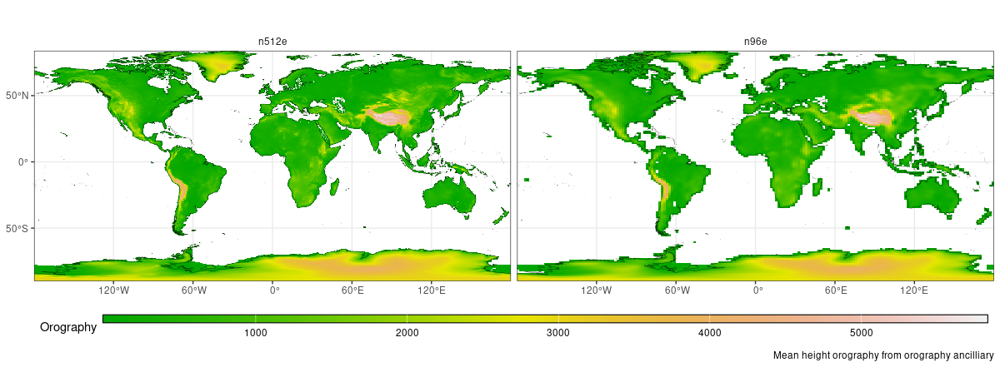

# ACCESS-AM3 n512e configuration

The `release-n512e` configuration is based on the beta `n96e` configuration with a few changes to accommodate for the higher resolution requirements. The main changes in the `release-n512e` configuration are:

* Uses climatological aerosols instead of prognostic aerosols.
* [The ancillaries uses high resolution data.](#ancilliaries)
* [IO Server is activated to improve performance.](#optimization)
* [Modified list of output variables and frequencies (3- and 6-hourly).](#output-variables)

The configuration uses a 1024x768 grid, with a nominal resolution of ~25 km and 85 vertical levels. 



## Initial conditions

The configuration can be initialise from a `n96e` or `n512e` restart. If there is a change of resolution, the reconfiguration step (`RECON`) will interpolate all the necessary variables. 

The suite also include a `fix_cable_restart` step to populate CABLE variables after the reconfiguration. This is necessary when the model is initialised from low resolution initial conditions. 

The default configuration runs with a `n96e` restart file from January 1, 2007. There may be other restart files available for different dates and resolutions. If you would like to find a restart for your particular purpose, please post in the [AM3 subcategory](https://forum.access-hive.org.au/c/atmosphere/am3/243) on the Hive Forum.  


To change the restart used, edit the file `site/nci_gadi.rc`:

```

```

The initial date and experiment length is defined in the `rose-suite.conf_nci_gadi` file. The default configuration runs for 1 month, from January 1, 2007. 

```
EXPT_BASIS='20070101T0000Z'
EXPT_RUNLEN='P1M'
```

## Ancilliaries

The ancillaries `n512e` where generated using 2 different workflows. The suite `u-dj813` was adapted to create the ozone and ESA (sst and sea ice) ancillaries. All the other ancilliaries, including vegetation fraction, vegetation function and soil are generated with the CCI-Ancilliary-Suite and based on the 300m resolution [CCI Land Cover dataset](https://catalogue.ceda.ac.uk/uuid/c19b0914521144ab8c18c91d586c6847/).

The following is a summary of the ancilliaries that differ from the beta `n96e` configuration.

* `aerosols`: monthly mean climatology based on a previous UM run with prognostic aerosols. The climatology is based on the monthly mean of the prognostic aerosols between years 1989 and 2009.
* `veg.frac` and `and veg.func`: based on ESA Land Cover Climate Change Initiative (Land_Cover_cci): [Water Bodies Map, v4.0](https://catalogue.ceda.ac.uk/uuid/7e139108035142a9a1ddd96abcdfff36) and [Global Land Cover Maps, Version 2.0.7](https://catalogue.ceda.ac.uk/uuid/b382ebe6679d44b8b0e68ea4ef4b701c). Centre for Environmental Data Analysis.
* `ozone`: monthly mean from 1978 to 2014 based on the CMIP6 dataset: Hegglin, Michaela; Kinnison, Douglas; Lamarque, Jean-Francois; Plummer, David (2016). CCMI ozone in support of CMIP6 - version 1.0. Earth System Grid Federation. [https://doi.org/10.22033/ESGF/input4MIPs.1115](https://doi.org/10.22033/ESGF/input4MIPs.1115)
* `sst` and `sea ice`: daily mean from 1981 to 2022 based on data from the 0.05° European Space Agency SST Climate Change Initiative (CCI) Analysis v3.0 and associated sea ice concentration data from the
EUMETSAT Ocean and Sea Ice Satellite Application Facility (OSI SAF). See [https://climate.esa.int/en/projects/sea-surface-temperature/](https://climate.esa.int/en/projects/sea-surface-temperature/)


## Output variables

The variables saved are listed [in this spreadsheet](https://docs.google.com/spreadsheets/d/11S5hY54BPHzoi2v6KYZeUeVo-76Q8QLqwKfjJCPuCrI/edit?gid=1519343531#gid=1519343531). The different groups of variables or "Packages" can be activated/deactivated from the gui.

* 2D Standard Diagnostics: 2D variables, 3 hourly output
* Land Diagnostics: Land variables on tiles, 3 hourly output
* 3D ERA5 Diagnostics: 37 pressure levels, 6 hourly and monthly mean output
* 3D Standard Diagnostics: All model levels, 6 hourly and monthly mean output
* COSP
* 2D Extra: extra 2D variables, 3 hourly output
* 3D Extra: extra 3D variables, 3 hourly output

> Currently the COPS, 2D Extra and 3D Extra packages are not active because they haven't been fully tested. They can be activated from the GUI in `UM/namelist/Model Input and Output/STASH Request and Profiles/STASH request` (upper right corner drop-down menu).

Output files are saved in the UM native format in `share/data/History_Data/`. Some of the variables are saved in monthly files, while others are saved in daily files. Check [the spreadsheet](https://docs.google.com/spreadsheets/d/11S5hY54BPHzoi2v6KYZeUeVo-76Q8QLqwKfjJCPuCrI/edit?gid=1519343531#gid=1519343531) to see how the variables are saved. 

The output is then converted to netcdf format and saved in `share/data/History_Data/netCDF/`. 

To save space, there is an option to delete the field files after they are converted to netcdf. In `app/netcdf_conversion/rose-app.conf`, set:

```
REMOVE_FF=true
```


## Optimization

The IO Server is active in the configuration to reduce walltime and SU usage. Usually the UM will read and write files on disk sequentially, but the IO Server gets extra processors to read and write files in parallel. This allows the UM to continue with the simulation while the IO Server is writing files to disk. 

The current IO Server configuration uses 48 processors divided in 8 tasks, each with 6 workers. This means that it will read/write 8 files in parallel. 

The IO Server requires:

* `rose-suite.cong`
    * `MAIN_IOS_NPROC=48` --> number of processors for the IO Server
    * `MAIN_OMPTHR_ATM=2` --> number of OpenMP threads 

* `app/um/rose-app.conf`
    * `ios_spacing=24` --> it's recommended to spread io processors across the nodes
    * `ios_tasks_per_server=6` --> number of tasks per server.

With a decomposition of 36x36 (`MAIN_ATM_PROCX=36`, `MAIN_ATM_PROCY=36`) and the current IO Server configuration, the simulation will use 2688 processors (56 nodes) with a walltime of ~2h 40min per simulated month. 
