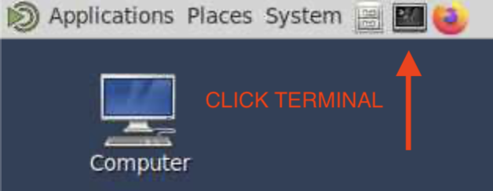

# ACCESS-AM3 Training

**ACCESS Community Workshop on Land and Coupled Modelling, 2026**

*Dr Benjamin J. E. Schroeter (ACCESS-NRI)*

---

The following is a guided walkthrough of the [ACCESS-AM3 Run a Model](https://docs.access-hive.org.au/models/run_a_model/run_access-am3/) docs for the purposes of the Coupled/Land Workshop 2026 training.

---

## Target Audience

The training is designed to cater to a range of skill levels, from those just starting out to those who have been working with numerical models throughout their career. However, in order too appeal to the broadest audience, the instructions that follow start from the basics.

**Assumptions**
- You are familiar with Git/Github
- You are comfortable using the Linux command line
- You have experience using the Australian Research Environment (ARE) at NCI.

---

## Prerequisites

Before you can begin the training, the following prerequisites are required

1. An NCI Account
2. Access to the ACCESS-AM3 configurations
3. Membership to the following projects on NCI
    - [access](https://my.nci.org.au/mancini/project/access/join): : ACCESS software sharing
    - [vk83](https://my.nci.org.au/mancini/project/vk83/join): ACCESS Models 
    - [xp65](https://my.nci.org.au/mancini/project/xp65/join): ACCESS Analysis Environments
    - [hr22](https://my.nci.org.au/mancini/project/hr22/join): Cylc Rose Workflow

If you have not done this, you will not be able to follow the training and will need to pair up with someone who has.

---

## Start a VDI Session on ARE

!!! tip 

    Do this at the start of the training while we are talking to ensure that your VDI session is ready.

While it is possible to complete this training over an SSH connection (and you are welcome to), we will be using the Australian Research Environment's (ARE) Virtual Desktop Infrastructure (VDI) to ensure a consistent training experience for participants.

---

To start a VDI session:
1. Go to the [Australian Research Environment](https://are.nci.org.au/) website and login with your **NCI username and password**.
2. Click on `Virtual Desktop` under *Featured Apps* to configure a new VDI instance with the following details:
    - Walltime (hours): `3`
    - Queue: `normalbw`
    - Compute Size: `small`
    - Project: `tm70`
    - Storage: `gdata/access+gdata/hh5+gdata/hr22+gdata/ki32`
3. Leave all other options as default and click "Launch".

Your VDI session will be submitted to the queue, please wait while it starts.

---

## Set up the Cylc8 workflow environment

The Cylc8 workflow environment contains all of the tools necessary to configure and run numerical suites.

1. Within the VDI session, launch a terminal (black icon, top left).

<div style="text-align: center"></div>

2. Within the terminal, enter the following commands to load the Cylc8 module:   

    ```shell
    module use /g/data/hr22/modulefiles
    module load cylc/8.6.3
    ```

You will now have access to the Cylc workflow engine and model execution infrastructure.

---

## Get the ACCESS-AM3 release configuration

The ACCESS-AM3 release configuration is maintained on GitHub. To access the released configuration, execute the following commands within your VDI session.

```shell
# Create the roses directory and move into it
mkdir -p ~/roses && cd ~/roses

# Clone the configurations repository
git clone git@github.com:ACCESS-NRI/access-am3-configs.git

# Move into the configs directory
cd access-am3-configs && 

# Check out the tagged n96e release configuration
git checkout release-n96e-3.0
```

You now have the released ACCESS-AM3 configuration ready to run.

---

## Adjust the run length

The default configuration has a run length of 12 months. For the purposes of this training, we will adjust the run length to something shorter so that we can see the suite to completion.

You may do this with the editor of your choice (i.e. `vim`, `nano`), or by running the following one-liner:

```shell
sed -i "s/EXPT_RUNLEN='P12M'/EXPT_RUNLEN='P1M'/" rose-suite.conf
```

You have now adjusted the run length of the default ACCESS-AM3 configuration to 1 month.

---

## Start a persistent session

The Cylc workflow engine runs on the NCI persistent sessions service. In order for the suite to run, a persistent session must be available.

Run the following commands in the terminal:

```shell
# Ensure that your persistent session setup is configured correctly
/g/data/hr22/bin/gadi-cylc-setup-ps -y

# Start a persisent session
persistent-sessions start -p $PROJECT -n cylc
```

Your persistent session will start with the name `cylc.$USER.$PROJECT.ps.gadi.nci.org.au`.

---

## Assign the persistent session to Cylc

In order to assign this session to Cylc, it needs to be added to a file located at `~/.persistent-sessions/cylc-session`. Do so with the following command.

```shell
echo cylc.$USER.$PROJECT.ps.gadi.nci.org.au > ~/.persistent-sessions/cylc-session
```

Now that your persistent session is set up, you can run ACCESS-AM3.

---

## Start the suite

Cylc8 has 3 steps to do this from the configuration directory:

- `cylc validate .` - Validates the suite configuration.
- `cylc install .` - Installs the suite to the working directory.
- `cylc play .` - Runs the suite.

The Cylc developers have provided a shorthand that will execute these in sequence to save time:

```shell
cylc vip
```

The suite will now execute and start submitting tasks to the scheduler (PBS).

---

## Monitor the suite

Now that the suite is running, we have the ability to monitor its progress. There are multiple options to do this, today we will make use of the Terminal User Interface (TUI).

Within the VDI terminal, execute the following command:

```shell
cylc tui
```

From this interface you can monitor suite progress, check logs and control exection of tasks. Take some time to navigate the TUI to understand how it works.

The tasks `atmos_main`, `install_ancil` etc. will change state as they move through their execution.

---

## Check the suite has completed

At the completion of the suite, the TUI will simply say that the workflow has the state `stopped`. This can be ambigious as (depending on the nature of the error) it can also mean that the suite has failed. The TUI also unhelpfully hides completed tasks by default.

A sure-fire way to check if the suite has completed is to look at the logs, in particular the overall scheduler log.

---

```shell
# Move to the cylc-run directory
cd /scratch/$PROJECT/$USER/cylc-run/access-am3-configs

# Move into the latest run's log directory (i.e. run1, run2 etc.)
cd run1/logs

# Check the scheduler log for failures
cat scheduler/log | grep "fail"

# Check the scheduler log for successful tasks
cat scheduler/log | grep "submitted to"
cat scheduler/log | grep "succeeded"
```

If you get no failures, and as many "succeeded" lines as there were tasks submitted, the suite has completed.

---

## Log Files - Finding and Interpreting Them

While on the subject of logs, ACCESS-AM3 produces the following categories of logging information:
- Cylc Logs
- UM Logs
- PBS Logs

---

## Cylc Logs

Logs for Cylc 8 are written by default to `/scratch/$PROJECT/$USER/cylc-run/[SUITE_NAME]/run[N]/log`.

There are a number of files and folders within this directory, however, the most useful items are:

- `rose-suite-run.log`: the output you would have seen upon starting the suite
- `job`: a directory containing the jobs (tasks) within the suite.

---

The `job` directory contents follow a certain structure:

`job/[TIMESTAMP]/[APP_NAME]/[RUN_ATTEMPT]`

Where:
- `TIMESTAMP` is the cycle point
- `APP_NAME` is the name of the app (component) of the suite
- `RUN_ATTEMPT` is the run attempt of the app, with NN symlinked to the latest run

---

Within the latest run, the following files may be present:
- `job`: The compiled script used to launch the job
- `job-activity.log`: Event history of the job on the scheduler
- `job.err`: Captured error messages output to STDERR
- `job.out`: Captured messages output to STDOUT
- `job.status`: The current status of the job

These files are the first place to look when diagnosing model issues.

---

## UM Logs

Further, you may also look at the raw UM log files (sometimes referred to as "pe_output" or similar) for the last few cycles, available at:

`/scratch/$PROEJCT$/$USER/cylc-run/[SUITE_NAME]/runN/work/YYYYMMDDT0000Z/atmos_main/pe_output`

These logs contain timestep-by-timestep output and is where most model-level errors appear (e.g. instabilities, failed reads of ancillary files) and may help to diagnose your issue.

---

## PBS Logs

The PBS job ID is printed when a task is submitted. `qstat -f <jobid>` or can be used to retrieve PBS-level information about walltime, memory, and exit codes.

For a given task, the PBS log (sometimes referred to as "PBS out") is located in the `job.out` file as described earlier.

---

## Model output

Model output is written to to the following path:

`/scratch/$PROJECT/$USER/cylc-run/[SUITE_NAME]/run[N]/share/History_Data`

Where:
- `SUITE_NAME` is the name of your suite
- `N` is the run count

---

Within this directory are the raw model output files, which follow the naming convention `*.p[a-m]YYYYMMM`, each representing a different output stream or dump frequency.

For convenience, the most frequently used data have been converted to NetCDF under:

`/scratch/$PROJECT/$USER/cylc-run/[SUITE_NAME]/run[N]/share/History_Data/netCDF`

These output files can be opened in the software of your choice to visualise and interpret results.

---

## Ancillary Files

Ancillary files (ancillaries) are pre-processed input fields used by the UM for quantities that aren't computed interactively - SSTs, sea ice, ozone, aerosol emissions, land use, soil properties, etc.

The locations of the ancillary files used by ACCESS-AM3 are detailed in the following configuration file:

`SUITE_DIR/app/install_ancil/rose-app.conf`

This file links the working copies of the model ancillaries to a curated set of inputs maintained by ACCESS-NRI under `/g/data/vk83/configurations/inputs/access-am3` and organised by modelling realm and/or configuration.

---

The majority of these files are generated using an external ancillary suite, the use of which is beyond the scope of this training. However, some limited manual modification may be possible by first copying one the target file to a space you control, modifying it, and editing the `install_ancil/rose-app.conf` file to point at your path.

!!! NOTE
    Common mistakes such as date/calendar mismatches, incorrect grid specifications, and missing storage directives in the PBS script may prevent custom ancillaries from being accepted by the model.

---

## Troubleshooting

Suites are compilcated pieces of software with many components. The potential for error increases with suite size and complexity, and each suite many need to be debugged differently.

To debug a Cylc8 suite in a general sense, the following instructions may be useful.

---

## 1. Identify the task/job in which the error occurred.

To identify where in the suite the failure occurred, navigate to the log directory:

```shell
cd /scratch/$PROJECT/$USER/cylc-run/[SUITE_NAME]/log
```

Navigate to the latest cycle point:

```shell
cd $(ls | tail -1)
```

Within this directory are subdirectories for each of the jobs within the suite. The last folder written is typically the location of the failure. To access the last attempted run of the job, execute the following command:

```shell
cd $(ls -t | head -1)/NN
```

---

## 2. Diagnose the error

Depending on how the suite has been designed, errors messages can appear in either `job.err` or `job.out`, and be logged as "Error", "Warning", "Critical" etc. To get a general idea of what went wrong, you can try the following commands:

```shell
# Case insensitive searches for error/warning/critical
grep -i -E "error|warning|critical" job.err
grep -i -E "error|warning|critical" job.out
```

On many occasions, this is sufficient to identify the issue, for example:

```shell
grep -i -E "error|warning|critical" job.err
??????????????????????????????      WARNING       ??????????????????????????????
?  Warning code: -10
?  Warning from routine: GET_ENV_VAR
?  Warning message: Environment variable ATMOS_COMP is not set.
?  Warning from processor: 0
?  Warning number: 0
??????????????????????????????      WARNING       ??????????????????????????????
?  Warning code: -10
?  Warning from routine: RCF_SMC_STRESS
?  Warning message: Input and output soil properties are identical.
?  Warning from processor: 0
?  Warning number: 1
```

If not, you will need to read the log with your favourite text editor (i.e. `vim`, `nano` etc.) to establish the nature and context of the error, including any stacktraces, which may point to further avenues to resolve your failure.

### 3. Digging deeper

If your error resides within the UM itself, you have the option to dig into the raw FORTRAN output from the model. This output is located in the following path:

```
/scratch/$PROJECT/$USER/cylc-run/access-am3-configs/run[N]/work/[TIMESTAMP]/atmos_main/pe_output
```

Where:
- `N` is the latest run
- `TIMESTAMP` is the cycle point that has failed

Within this directory are the following files:
- `am3.fort6.pe[NNN]` an output stream from a given processor
- `am3.fort6.pe.stdout` an overall output stream

These files may contain additional information to help diagnose your error, however, their interpretation is beyond the scope of this training.